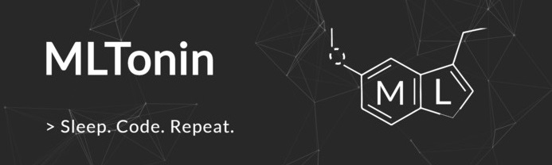

# mltonin-machine-learning

  

MLTonin was the recipient of Electric City Hacks IV's Best Machine Learning Hack and Wolfram's Best Use of Wolfram API award.  
&nbsp;  
This repository contains the machine learning portion of our project, which includes:
- Dataset Generation
- Model Selection
- Training  
&nbsp;  

Team members:
- [Andre Vallestero](https://github.com/AndreVallestero)
- [Rico Zhu](https://github.com/ricozhuthegreat)
- [Dominic Morales](https://github.com/sirdommat)  
&nbsp;  

This project was created during Electric City Hacks IV on November 1-3, 2019.  
Check out our devpost [here!](https://devpost.com/software/mltonin-frontend)
